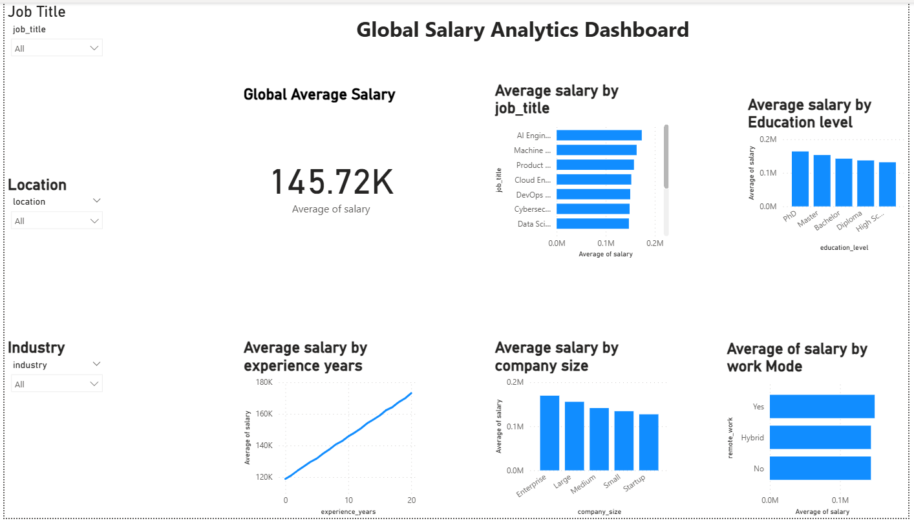

# 📊 Global Salary Analytics Dashboard

## 📌 Project Overview

This project analyzes a dataset of 250,000 job records to uncover insights into salary trends across job roles, experience levels, education levels, and industries.

## 🛠 Tools Used

* Python (Pandas) – Data cleaning & analysis
* Power BI – Dashboard & visualization

## 📈 Key Insights

* Salaries increase consistently with experience (~45% growth from entry to senior roles)
* AI & Machine Learning roles offer the highest salaries
* Enterprise companies pay significantly more than startups
* Higher education levels correlate with higher salaries
* Remote roles show slightly higher salary trends

## 📊 Dashboard Preview

## 📂 Files Included

* salary_analysis.ipynb → Data cleaning & analysis
* Global Salary Analytics Dashboard.pbix → Power BI dashboard
* dashboard.png → Dashboard preview image

